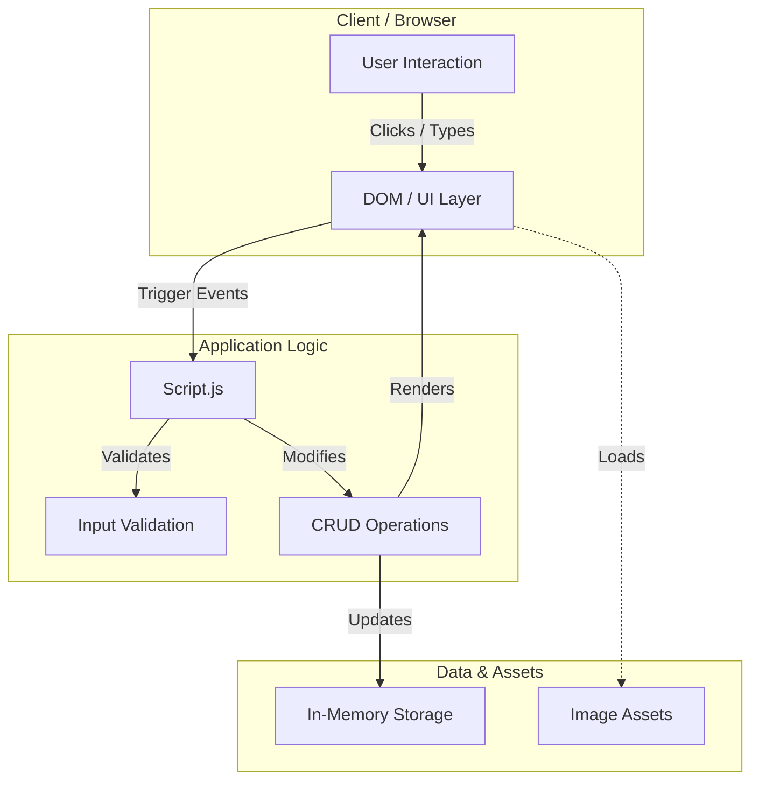
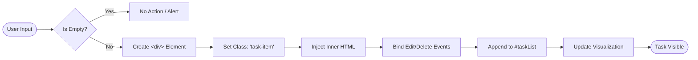

# Technical Implementation Overview

## 📘 Project Scope
The **Task Management Dashboard** is a high-performance, client-side application designed for efficiency and simplicity. This document outlines the technical architecture, data flow, and component structure of the system.

## 🏗️ System Architecture
The application follows a **Monolithic Client-Side Architecture** where the structure (HTML), style (CSS), and logic (JS) are tightly integrated but clearly separated by concern.

---

## ⚡ Task Lifecycle Flow
The following flowchart illustrates the logical execution path when a user adds and manages a new task.

---

## 📂 Component Breakdown
A detailed breakdown of the file structure and the responsibility of each key component.

| Component | Type | Responsibility | Key Functions / Selectors |
| :--- | :--- | :--- | :--- |
| **Task.html** | `Structure` | Defines the DOM topology, including the dashboard grid, charts container, and task list area. | `#taskInput`, `#taskList`, `.dashboard` |
| **Script.js** | `Controller` | Acts as the central event controller. Handles user input, manipulates the DOM, and manages ephemeral state. | `addTask()`, `editTask()`, `deleteTask()` |
| **Style Blocks** | `Presentation` | Manages visual hierarchy, responsive layouts, and state indicators (e.g., overdue colors). | `.task-card`, `.sidebar`, `.header` |
| **Images/** | `Assets` | Contains static optimized assets for UI icons and graph visualizations. | `editing.png`, `bin.png`, `Graph 1.png` |

## 📊 Data & State Management
Currently, the application operates with **Ephemeral State Persistence**.
*   **Storage scope:** Session-based (Refresh clears data)
*   **Data Structure:** DOM-bound (State is reflected directly in the HTML Tree)
*   **Complexity:** O(1) for Add, O(1) for Delete (Direct Reference)
